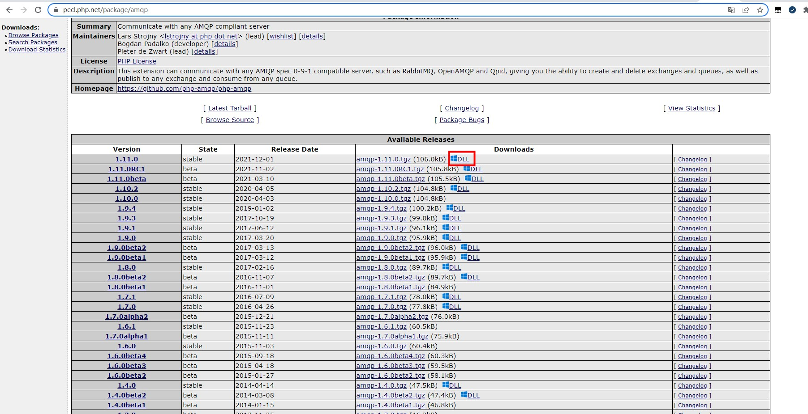
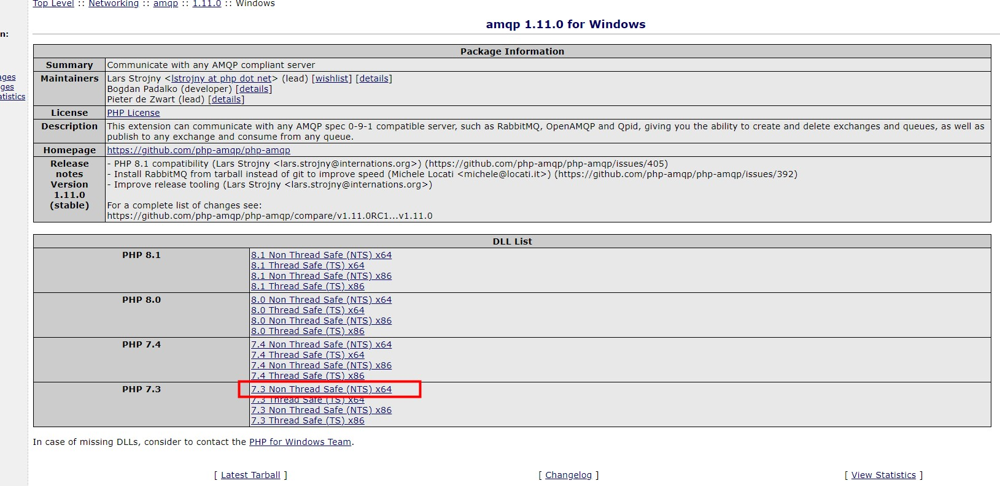
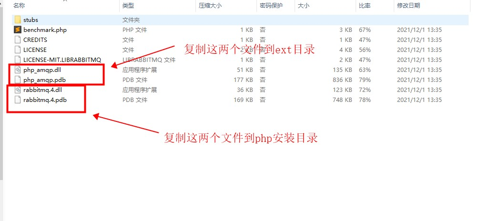
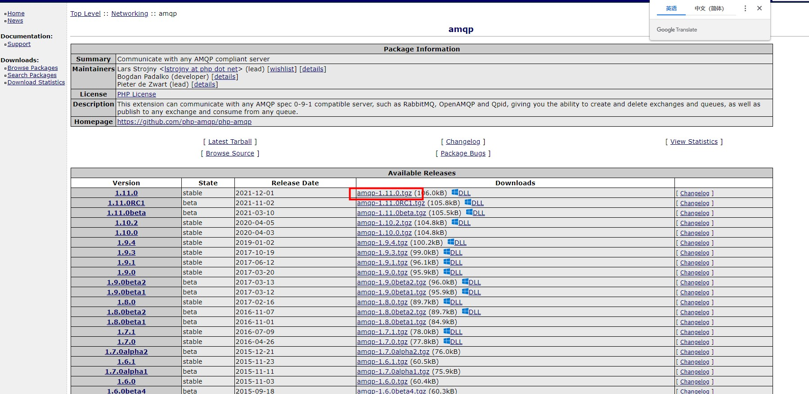

### php使用rabbitmq
[AMQP api文档](http://docs.php.net/manual/da/book.amqp.php)

##### rabbitmq概念

|概念|说明|
|:---|:---|
|Broker|接收和分发消息的应用,就是 Rabbiqmq Server|
|Virtual Host|类似于网络中的namespace,有多个用户使用时，可以为每个用户创建不同的vhsot|
|Connection|连接。publisher/consumer和broker之间的TCP连接。断开连接的操作只会在client端进行，Broker不会断开连接，除非出现网络故障或broker服务出现问题|
|Channel|渠道。如果每一次访问RabbitMQ都建立一个Connection，在消息量大的时候建立TCP Connection的开销会比较大且效率也较低。Channel是在connection内部建立的逻辑连接，如果应用程序支持多线程，通常每个thread创建单独的channel进行通讯，AMQP method包含了channel id帮助客户端和message broker识别channel，所以channel之间是完全隔离的。Channel作为轻量级的Connection极大减少了操作系统建立TCP connection的开销|
|Exchange|路由。根据分发规则，匹配查询表中的routing key，分发消息到queue中去|
|Queue|消息的队列。消息最终被送到这里等待消费，一个message可以被同时拷贝到多个queue中。|
|Binding|绑定。exchange和queue之间的虚拟连接，binding中可以包含routing key。Binding信息被保存到exchange中的查询表中，用于message的分发依据|


推送一条消息的流程如下:
1. **生产者**往服务器(Broker)推送了一条消息
2. 服务器接收到了消息，根据消息标识送往不同的virtual host
3. 然后exchange会根据消息的路由key和exchange类型将消息分发到自己所属的队列(Queue)中区
4. 然后**消费者**端会通过Connection中的Channel获取刚刚推送的消息，拉取消息进行消费。

Tips: 某个Exchange有哪些属于自己的Queue，是由Binding绑定关系决定的。

**Exchange类型**

|类型|说明|
|:---|:---|
|fanout|Fanout-Exchange会将它接收到的消息发往所有与他绑定的Queue中。|
|direct|Direct-Exchange会把它接收到的消息发往与它有绑定关系且Routingkey完全匹配的Queue中（默认）。|
|topic|Topic-Exchange与Direct-Exchange相似，不过Topic-Exchange不需要全匹配，可以部分匹配，它约定：Routingkey为一个句点号“. ”分隔的字符串（我们将被句点号“. ”分隔开的每一段独立的字符串称为一个单词）。|
|header|Header-Exchange不依赖于RoutingKey或绑定关系来分发消息，而是根据发送的消息内容中的headers属性进行匹配。此模式已经不再使用，大家知道即可。|

##### 安装extension
> php -m

查看是否安装 amqp 扩展,有安装的话跳过这一步，没有的话开始安装
```shell
# 查看php版本
$ php -v
PHP 7.3.29 (cli) (built: Jun 29 2021 12:30:03) ( NTS MSVC15 (Visual C++ 2017) x64 )
Copyright (c) 1997-2018 The PHP Group
Zend Engine v3.3.29, Copyright (c) 1998-2018 Zend Technologies
```

**Window安装**

打开 [https://pecl.php.net/package/amqp](https://pecl.php.net/package/amqp) 点击**DLL**进去下载对应的版本


解压下载的压缩文件,复制指定文件到对应的目录


**Linux安装**

通过编译安装的php

打开 [https://pecl.php.net/package/amqp](https://pecl.php.net/package/amqp) 下载压缩包


通过yum安装的php

##### 生产消息
```php
<?php
        $conn = new AMQPConnection([
            'host' => '192.165.34.71',
            'vhost' => 'vhost',
            'port' => 5672,
            'login' => 'test',
            'password' => 'test'
        ]);
        
        $conn->connect();
        
        $ch = new AMQPChannel($conn);
        $exchange = new AMQPExchange($ch);
        $exchange->setType(AMQP_EX_TYPE_DIRECT);
        $exchange->setFlags(AMQP_DURABLE);
        $exchange->setName('amq.direct');
        $exchange->declareExchange();
        
        $q = new AMQPQueue($ch);
        $q->setFlags(AMQP_DURABLE);
        $q->setName('queue001');
        $q->declareQueue();
        $q->bind($exchange->getName(), 'queue001-route-key');
        
        $message = "Hello World!";
        
        $exchange->publish($message, 'queue001-route-key');
```


##### 消费消息
```php
        $conn = new AMQPConnection([
            'host' => '192.165.34.71',
            'vhost' => 'vhost',
            'port' => 5672,
            'login' => 'test',
            'password' => 'test'
        ]);
        
        $conn->connect();
        
        $ch = new AMQPChannel($conn);     
        
        $q = new AMQPQueue($ch);
        $q->setFlags(AMQP_DURABLE);
        $q->setName('queue001');
        $q->declareQueue();

        while ($message = $q->get()) {
            if (empty($message)) {
                //@sleep(1);
                //continue;
                break;
            }
            var_dump($message->getBody());

            var_dump($message->getRoutingKey());
            var_dump($message->getExchangeName());           
            $q->ack($message->getDeliveryTag());
        }
```

##### 死信队列
创建一个死信队列
```php
        $conn = new AMQPConnection([
            'host' => '192.165.34.71',
            'vhost' => 'vhost',
            'port' => 5672,
            'login' => 'test',
            'password' => 'test'
        ]);

        $conn->connect();
        
        $ch = new AMQPChannel($conn);
        $exchange = new AMQPExchange($ch);
        // exchange 类型指定为 fanout        
        $exchange->setType(AMQP_EX_TYPE_FANOUT);
        $exchange->setFlags(AMQP_DURABLE);
        $exchange->setName('dlx.exchange');
        $exchange->declareExchange();

        $q = new AMQPQueue($ch);
        $q->setFlags(AMQP_DURABLE);
        $q->setName('dlx.queue');
        $q->declareQueue();
        
        while (true) {
            $message = $q->get();
            if (empty($message)) {
                //@sleep(1);
                //continue;
                break;
            }
            var_dump($message->getBody());
            $q->ack($message->getDeliveryTag());
        }
```

```php
<?php
        $conn = new AMQPConnection([
            'host' => '192.165.34.71',
            'vhost' => 'vhost',
            'port' => 5672,
            'login' => 'test',
            'password' => 'test'
        ]);

        $conn->connect();

        $ch = new AMQPChannel($conn);

        $exchange = new AMQPExchange($ch);
        $exchange->setType(AMQP_EX_TYPE_DIRECT);
        $exchange->setFlags(AMQP_DURABLE);
        $exchange->setName('amq.direct');
        $exchange->declareExchange();

        $q = new AMQPQueue($ch);
        $q->setFlags(AMQP_DURABLE);
        $q->setName('ttl.queue');
        //设置死信队列exchange
        $q->setArgument('x-dead-letter-exchange', 'dlx.exchange');
        //设置消息超过60秒自动过期
        $q->setArgument('x-message-ttl',60000);
        $q->declareQueue();
        $q->bind($exchange->getName(), $q->getName());

        for ($i = 0; $i < 20; $i++) {
            if ($i > 9) {
                $exchange->publish(strval($i), 'ttl.queue', AMQP_DURABLE);
            } else {
                $exchange->publish(strval($i), 'ttl.queue', AMQP_DURABLE, [
                    //设置消息的过期时间为20秒，推送之后20秒可以看到有10条消息通过 dlx.exchange 进入 dlx.queue
                    //60秒后剩下的消息过期，全部进入 dlx.queue 队列
                    'expiration' => 20000,
                    'delivery_mode' => 2 //2 持久化(Persistent) 1 不持久化(Non-persistent)
                ]);
            }
        }
```

**参考资料**

[和耳朵 RabbitMQ 专栏](https://juejin.cn/column/6960607399388381197) <br/>
[搬山老猿 RabbitMQ 专栏](https://juejin.cn/column/7009881205474623501)