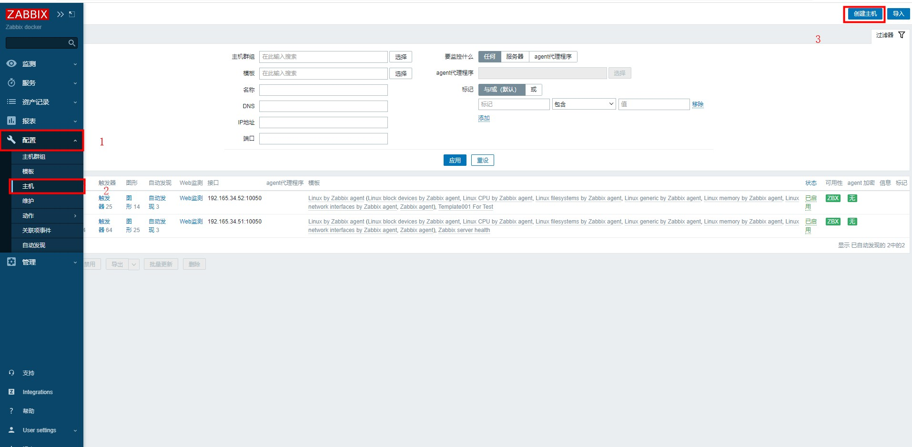
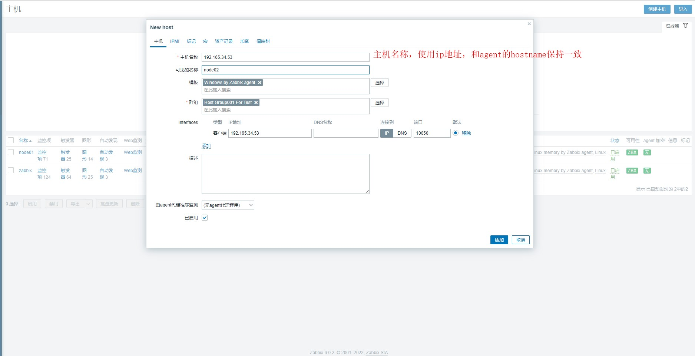

## zabbix 安装和使用
[官网下载地址](https://www.zabbix.com/download)

[docker镜像](https://hub.docker.com/u/zabbix)

[Zabbix使用教程](https://www.cnblogs.com/xdzy/p/9460025.html)

[zabbix3.4.1使用教程 - zabbix搭建到使用看这一篇就够了](https://blog.csdn.net/weixin_42170236/article/details/99942384)

默认用户名:Admin 

密码:zabbix

#### 添加host




#### 在对应的主机安装 zabbix-agent
添加安装源
```shell
sudo rpm -Uvh https://repo.zabbix.com/zabbix/6.0/rhel/7/x86_64/zabbix-release-6.0-1.el7.noarch.rpm
sudo yum clean all
```

安装
```shell
sudo yum install -y zabbix-agent
```

编辑配置文件
> sudo vi /etc/zabbix/zabbix_agentd.conf

```shell
# zabbix server 的ip地址，0.0.0.0/0表示可以是任意ipv4的ip地址
Server=0.0.0.0/0

# zabbix server 服务地址
ServerActive=192.165.34.51:10051

# 主机名称，和后台配置保持一致
Hostname=192.165.34.53
```

启动zabbix-agent并且将zabbix-agent设置为开机自动启动
```shell
sudo systemctl restart zabbix-agent
sudo systemctl enable zabbix-agent
```


##### 自定义推送消息脚本

/usr/lib/zabbix/alertscripts


